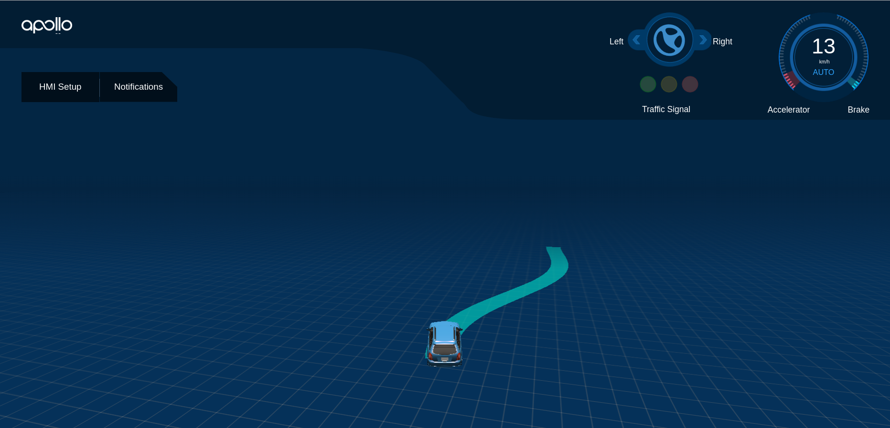

## 1.安装原版ubuntu 14.04
[http://www.ubuntu.org.cn/download/alternative-downloads](http://www.ubuntu.org.cn/download/alternative-downloads)  

## 2.安装对应ubuntu 14.04的indigo版ROS
ROSA安装可参考官网[http://wiki.ros.org/indigo/Installation/Ubuntu](http://wiki.ros.org/indigo/Installation/Ubuntu)
也可以按照下面的命令安装  
#### （1）构建源  
```
sudo sh -c 'echo "deb http://packages.ros.org/ros/ubuntu $(lsb_release -sc) main" > /etc/apt/sources.list.d/ros-latest.list'
```
#### （2）设置秘钥
```
sudo apt-key adv --keyserver hkp://ha.pool.sks-keyservers.net:80 --recv-key 421C365BD9FF1F717815A3895523BAEEB01FA116
```
#### （3）更新源
```
sudo apt-get update
```
#### （4）安装ros-indigo
```
sudo apt-get install ros-indigo-desktop-full
```
####  (5)初始化ROS
```
sudo rosdep init
rosdep update
```
####  (6)设置环境变量
```
echo "source /opt/ros/indigo/setup.bash" >> ~/.bashrc
source ~/.bashrc
```

## 3.安装Apollo Kernel
（这里百度是对Ubuntu内核进行了修改，增强了实时性，和系统漏洞补丁）  
[https://github.com/ApolloAuto/apollo-kernel](https://github.com/ApolloAuto/apollo-kernel)  
为运行Apollo软件提供了kernel层面的支持。  
从这里下载linux-4.4.32-apollo-1.0.0.tar.gz：   
[https://github.com/ApolloAuto/apollo-kernel/releases](https://github.com/ApolloAuto/apollo-kernel/releases)  
解压安装：  
```
tar zxvf linux-4.4.32-apollo-1.0.0.tar.gz
cd install
sudo ./install_kernel.sh
```
重启系统使系统进入新内核。  

## 4.安装Apollo本体
https://github.com/ApolloAuto/apollo
#### （1）下载资源：  
```
git clone https://github.com/ApolloAuto/apollo.git
```
#### （2）安装docker环境：
```
cd ~/apollo  
bash docker/scripts/install_docker.sh  
```
#### （3）先注销再重新登录，然后测试一下docker是否安装成功：  
```
docker ps  
```
#### （4）设置环境：  
```
bash docker/scripts/dev_start.sh  
bash docker/scripts/dev_into.sh  
```
#### （5）编译：  
```
bash apollo.sh build  
```

## 5.安装Apollo ROS支持
https://github.com/ApolloAuto/apollo-platform  
相对于原版ROS，做出了如下改进：  
。增强了ROS的去中心化特性；  
。基于共享内存的更高效的通信；  
。支持Protobuf；  
从这里下载ros-indigo-apollo-1.0.0.x86_64.tar.gz：  
https://github.com/ApolloAuto/apollo-platform/releases  
#### （1）解压缩：  
```
tar zxvf ros-indigo-apollo-1.0.0.x86_64.tar.gz
```
#### （2）将解压后的文件夹ros拷贝到apollo工程中：
```
rsync -av ros/ ~/apollo/third_party/ros_x86_64
source ~/apollo/third_party/ros_x86_64/setup.bash
```


##6.运行Apollo
####（1）进入apollo 执行hmi.sh
```
cd ~/apollo
bash scripts/hmi.sh
```
#### (2)在浏览器输入http://localhost:8887后回车，在Debug中开启Dreamview，然后点击右上方的Dreamview。
#### (3)在另一个终端里输入：
```
rosbag play -l ./docs/demo_guide/demo.bag
```
然后就可以看到界面播放demo.bag数据啦：

当然，这只是播放录像而已，要搭建一个真实的无人车所需要的硬件诸如工业电脑IPC、GPS、IMU、CANBUS卡等

