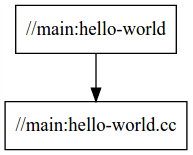

# Bazel简介 #
================
## Bazel是什么？ ##
---------
Bazel是一个构建工具，即一个可以运行编译和测试来组装软件的工具，跟Make、Ant、Gradle、Buck、Pants和Maven一样。    
## 使用Bazel自定义APT存储库安装Bazel ##
### 第1步：安装JDK ###
安装JDK 8：  
sudo apt-get install openjdk-8-jdk  
在Ubuntu 上，您必须使用PPA：  
sudo add-apt-repository ppa:webupd8team/java  
sudo apt-get update && sudo apt-get install oracle-java8-installer  
### 第2步：添加Bazel分发URI作为包源 ###
注意：这是一次性设置步骤。  
echo "deb [arch=amd64] http://storage.googleapis.com/bazel-apt stable jdk1.8" | sudo tee /etc/apt/sources.list.d/bazel.list  
curl https://bazel.build/bazel-release.pub.gpg | sudo apt-key add -  
如果您想安装Bazel的测试版本，请stable用testing。  
### 第3步：安装并更新Bazel ###
sudo apt-get update && sudo apt-get install bazel  
安装完成后，您可以使用以下命令升级到较新版本的Bazel：  
sudo apt-get upgrade bazel  
## Bazel有什么特殊之处 ##
Bazel是设计用来配合Google的软件开发模式。有以下几个特点：  
多语言支持：Bazel支持Java，Objective-C和C++，可以扩展来支持任意的编程语言  
高级别的构建语言：工程是通过BUILD语言来描述的。BUILD语言以简洁的文本格式，描述了由多个小的互相关联的库、二进制程序和测试程序来组成的一个项目。而与之相比，Make这类的工具需要描述各个单独的文件和编译的命令  
多平台支持：同一套工具和同样的BUILD文件可以用来构建不同架构和不同平台的软件。在Google，我们使用Bazel来构建在我们数据中心系统中运行的服务器端程序和在手机上运行的客户端应用程序。  
重现性[Reproducibility]：在BUILD文件中，每个库，测试程序，二进制文件必须明确完整地指定直接依赖。当修改源代码文件后，Bazel使用这个依赖信息就可以知道哪些必须重新构建，哪些任务可以并行执行。这意味者所有的构建都是增量形式的并能够每次都生成相同的结果。  
伸缩性[Scalability]：Bazel可以处理巨大的构建；在Google，一个服务器端程序超过100k的源码是常有的事情，如果没有文件被改动，构建过程需要大约200ms   
## Google开发模式是怎样的？ ##
对于我们的服务器端代码库，我们的开发流程如下：  

所有的服务器端代码库都在一个巨大的版本控制系统里  
每个人都用Bazel构建软件  
不同的组负责源码树的不同部分，所有的组件都是作为BUILD目标来用  
分支主要是用来管理发布，所以每个人都在最新版本上开发软件  
Bazel是以下理念的奠基石：由于Bazel需要所有的依赖都被完整地指定，我们可以预测改动影响了哪些程序和测试，并在提交前执行他们。  

## 为什么我要使用Bazel？ ##

Bazel可以成倍提高构建速度，因为它只重新编译需要重新编译的文件。类似的，它会跳过没有被改变的测试。  
Bazel产出确定的结果。这消除了增量和干净构建，开发机器和持续集成之间的构建结果的差异。  
Bazel可以使用同一个工程下的相同的工具来构建不同的客户端和服务器端应用程序。例如，你可以在一次提交里修改一个客户端/服务器协议，然后测试更新后的手机程序和服务器端程序能够正常工作，构建时使用的是同样的工具，利用的都是上面提到的Bazel的特性。  

## Bazel最擅长做什么？ ##
Bazel适合于构建和测试有如下特点的项目：  

有庞大代码库的项目  
用（多种）需要编译的语言写的项目  
在多平台上部署的项目  
有大量测试的工程  

## 理解BUILD文件  ##

一个BUILD文件包含了几种不同类型的指令。其中最重要的是编译指令，它告诉Bazel如何编译想要的输出，比如可执行二进制文件或库。BUILD文件中的每一条编译指令被称为一个target，它指向一系列的源文件和依赖，一个target也可以指向别的target。  

## 举个例子 ##
下面这个hello-world的target利用了Bazel内置的cc_binary编译指令，来从hello-world.cc源文件（没有其他依赖项）构建一个可执行二进制文件。指令里面有些属性是强制的，比如name，有些属性则是可选的，srcs表示的是源文件。  

cc_binary(  
    name = "hello-world",  
    srcs = ["hello-world.cc"],  
)  
## 语句解读 ##
1，name这个target指被编译成静态库以后叫什么名字；  
2，srcs这个target指哪些源文件需要被编译，我这里使用通配符.（点），即cc_binary文件夹下所有.h和.m都需要被编译；  
3，hdrs这个target指哪些头文件是public。  

##  使用Bazel编译项目 ##
Bazel提供了一些编译的例子，在https://github.com/bazelbuild/examples/ ，可以clone到本地试一下。其中examples/cpp-tutorial目录下包含了这么些文件：  
examples  
└── cpp-tutorial  
    ├──stage1  
    │  └── main  
    │      ├── BUILD  
    │      ├── hello-world.cc  
    │  └── WORKSPACE  
    ├──stage2  
    │  ├── main  
    │  │   ├── BUILD  
    │  │   ├── hello-world.cc  
    │  │   ├── hello-greet.cc  
    │  │   ├── hello-greet.h  
    │  └── WORKSPACE  
    └──stage3  
       ├── main  
       │   ├── BUILD  
       │   ├── hello-world.cc  
       │   ├── hello-greet.cc  
       │   └── hello-greet.h  
       ├── lib  
       │   ├── BUILD  
       │   ├── hello-time.cc  
       │   └── hello-time.h  
       └── WORKSPACE  
可以看到分成了3组文件，分别对应本文中的3个例子。在第一个例子中，我们首先学习如何构建单个package中的单个target。在第二个例子中，我们将把整个项目拆分成单个package的多个target。第三个例子则将项目拆分成多个package，用多个target编译。  

## 1. 编译你的第一个Bazel项目 ##

首先进入到cpp-tutorial/stage1目录下，然后运行以下指令：  

bazel build //main:hello-world  

注意target中的//main:是BUILD文件相对于WORKSPACE文件的位置，hello-world则是我们在BUILD文件中命名好的target的名字。  

然后Bazel就会有一些类似这样的输出：  

INFO: Found 1 target...  
Target //main:hello-world up-to-date:  
  bazel-bin/main/hello-world  
INFO: Elapsed time: 2.267s, Critical Path: 0.25s  

恭喜，这样你的第一个Bazel target就编译好了！Bazel将编译的输出放在项目根目录下的bazel-bin目录下，可以看一下这个目录，理解一下Bazel的输出结构。  

现在你可以测试你刚刚生成的二进制文件了：  
bazel-bin/main/hello-world  
## 2. 查看依赖图 ##

一个成功的build将所有的依赖都显式定义在了BUILD文件中。Bazel使用这些定义来创建项目的依赖图，这能够加速编译的过程。  

让我们来可视化一下我们项目的依赖吧。首先，生成依赖图的一段文字描述（即在工作区根目录下运行下述指令）：  
bazel query --nohost_deps --noimplicit_deps 'deps(//main:hello-world)' \
  --output graph  
这个指令告诉Bazel查找target //main:hello-world的所有依赖项（不包括host和隐式依赖），然后输出图的文字描述。再把文字描述贴到GraphViz里，你就可以看到如下的依赖图了。可以看出这个项目是用单个源文件编译出的单个target，并没有别的依赖。  
  
好的，到目前为止，我们已经建立了工作区，编译了一个项目，并且查看了它的依赖。  

Bazel超级详细讲解：http://www.cnblogs.com/Jack47/p/bazel-faq.html    
       https://www.cnblogs.com/Jack47/p/build-in-the-cloud.html    

