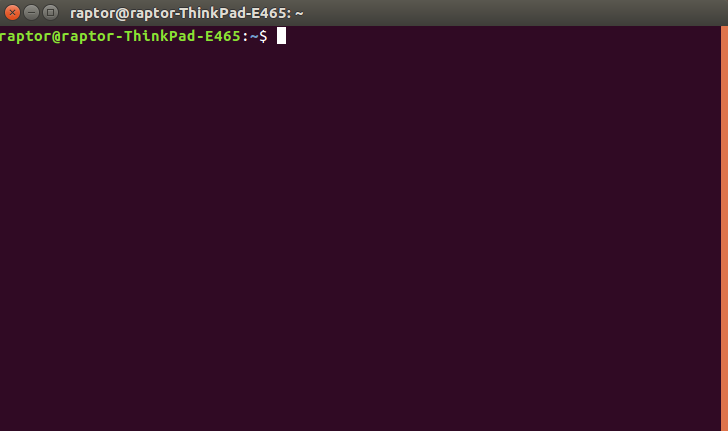

### 引言
现在我们使用的操作系统（Windows、Mac OS、Android、iOS 等）都是带图形界面的,然而在计算机的早期并没有图形界面，我们只能通过一个一个地命令来控制计算机。对于图形界面，用户点击某个图标就能启动某个程序；对于命令行，用户输入某个程序的名字（可以看做一个命令）就能启动某个程序。这两者的基本过程都是类似的，都需要查找程序在硬盘上的安装位置，然后将它们加载到内存运行。  
换句话说，图形界面和命令行要达到的目的是一样的，都是让用户控制计算机。然而，真正能够控制计算机硬件（CPU、内存、显示器等）的只有操作系统内核（Kernel），图形界面和命令行只是架设在用户和内核之间的一座桥梁。由于安全、复杂、繁琐等原因，用户不能直接接触内核（也没有必要），需要另外再开发一个程序，让用户直接使用这个程序；该程序的作用就是接收用户的操作（点击图标、输入命令），并进行简单的处理，然后再传递给内核。如此一来，用户和内核之间就多了一层“代理”，这层“代理”既简化了用户的操作，也保护了内核，见图1。  
  
用户界面和命令行就是这个另外开发的程序，就是这层“代理”。在Linux下，这个命令行程序叫做 Shell。
### 一.Shell是什么
Shell俗称壳（用来区别于核），是指“为使用者提供操作界面”的软件（命令解析器）。它类似于DOS下的command.com和后来的cmd.exe。它接收用户命令，然后调用相应的应用程序。作为命令语言，它交互式解释和执行用户输入的命令或者自动地解释和执行预先设定好的一连串的命令；作为程序设计语言，它定义了各种变量和参数，并提供了许多在高级语言中才具有的控制结构，包括循环和分支。
### 二.Shell的功能
Shell 除了能解释用户输入的命令，将它传递给内核，还可以：  
1. 调用其他程序，给其他程序传递数据或参数，并获取程序的处理结果；  
2. 在多个程序之间传递数据，把一个程序的输出作为另一个程序的输入；  
3. Shell 本身也可以被其他程序调用。  
### 三.Shell的用途
Shell 本身支持的命令并不多，但是它可以调用其他的程序，每个程序就是一个命令，这使得 Shell 命令的数量可以无限扩展，其结果就是 Shell 的功能非常强大，完全能够胜任 Linux 的日常管理工作，如文本或字符串检索、文件的查找或创建、大规模软件的自动部署、更改系统设置、监控服务器性能、发送报警邮件、抓取网页内容、压缩文件等。
### 四.Shell的分类
#### shell基本上分两大类：  
一：图形界面shell（Graphical User Interface shell 即 GUI shell）  
例如：应用最为广泛的 Windows Explorer （微软的windows系列操作系统），还有也包括广为人知的 Linux shell，其中linux shell 包括 X window manager (BlackBox和FluxBox），以及功能更强大的CDE、GNOME、KDE、 XFCE。  
二：命令行式shell（Command Line Interface shell ，即CLI shell）  
例如：  
bash / sh / ksh / csh（Unix/linux 系统）  
（MS-DOS系统）  
cmd.exe/ 命令提示字符（Windows NT 系统）  
Windows PowerShell（支持 .NET Framework 技术的 Windows NT 系统）  
传统意义上的shell指的是命令行式的shell，以后如果不特别注明，shell是指命令行式的shell,如Linux系统的shell（见图2），进入方式有：通过Teminal终端图标进入或者通过快捷键“Ctrl+Alt+T”进入。  
  
#### bash和sh的区别
以Linux系统为例，其中bash shell是Linux的默认shell。在现代的Linux上，sh已经被bash代替，/bin/sh往往是指向/bin/bash的符号链接。bash兼容sh意味着，针对sh编写的 Shell代码可以不加修改地在bash中运行。  
尽管如此，bash 和 sh 还是有一些不同之处：  
●一方面，bash 扩展了一些命令和参数；  
●另一方面，bash 并不完全和 sh 兼容，它们有些行为并不一致，但在大多数企业运维的情况下区别不大，特殊场景可以使用 bash 代替 sh。  
另外，可通过命令查看Linux系统可用的shell（见图3）和Linux系统默认的shell（见图4）  
  
  
### 五.Shell提示符
提示符是通往 Shell 的大门，是输入 Shell 命令的地方。  
对于普通用户，Base shell 默认的提示符是美元符号$；对于超级用户（root 用户），Bash Shell 默认的提示符是井号#。该符号表示 Shell 等待输入命令。  
不同的 Linux 发行版使用的提示符格式不同。例如在 CentOS 中，默认的提示符格式为：[mozhiyan@localhost ~]$  
Shell 通过PS1和PS2两个环境变量来控制提示符格式：  
● PS1 控制最外层命令行的提示符格式。  
● PS2 控制第二层命令行的提示符格式。  
在 Shell 中初次输入命令，使用的是 PS1 指定的提示符格式；如果输入一个命令后还需要输入附加信息，Shell 就使用 PS2 指定的提示符格式。  
### 六.运行Shell脚本的两种方式
#### 1.作为可执行程序  
Shell 脚本也是一种解释执行的程序，可以在终端直接调用（需要使用 chmod 命令给 Shell 脚本加上执行权限），如图5所示：
  
第2行中，chmod +x表示给 test.sh 增加执行权限；  
第3行中，"./"表示当前目录，整条命令的意思是执行当前目录下的 test.sh 脚本。如果不写"./"，Linux 会到系统路径（由 PATH 环境变量指定）下查找 test.sh，而系统路径下显然不存在这个脚本，所以会执行失败。  
通过这种方式运行脚本，第一行一定要写对，好让系统查找到正确的解释器。  
举例如下，首先在文本编辑器中新建一个名为test.sh（扩展名sh代表shell）的文件，内容如图6左侧所示；然后按图5命令执行，结果如图6右侧。  
  
##### 在这里，提一下source 命令:
source FileName： 在当前bash环境下读取并执行FileName中的命令； 该命令通常用命令“.”来替代。  
这两个命令都以一个脚本为参数，该脚本将作为当前shell的环境执行，即不会启动一个新的子进程。所有在脚本中设置的变量将成为当前Shell的一部分。  
source filename 与 sh filename 及./filename执行脚本的区别:  
●当shell脚本具有可执行权限时，用sh filename与./filename执行脚本是没有区别的。./filename是因为当前目录没有在PATH中，所有”.”是用来表示当前目录的。  
●sh filename 重新建立一个子shell，在子shell中执行脚本里面的语句，该子shell继承父shell的环境变量，但子shell新建的、改变的变量不会被带回父shell。  
●source filename：这个命令其实只是简单地读取脚本里面的语句依次在当前shell里面执行，没有建立新的子shell。那么脚本里面所有新建、改变变量的语句都会保存在当前shell里面。  
#### 2.作为解释器参数  
这种运行方式是，直接运行解释器，其参数就是shell脚本的文件名，见图7：  
  
### 七.Shell命令
#### 1.常用命令：
(1)echo :字符串输出命令。与PHP的echo命令类似，格式是echo string  
(2)print :格式化输出。格式是printf format-string [arguments...] 其中，format-string: 为格式控制字符串；arguments: 为参数列表。  
(3)rm :删除文件，格式是rm file  
(4)test :命令用于检查某个条件是否成立，它可以进行数值、字符和文件三个方面的测试，比如数值：test $[num1] -eq $[num2]，num1和num2是数值；字符：test $num1 = $num2，num1和num2是字符；文件：est -e ./bash，-e表示文件是否存在。  
(5)cp :文件拷贝，格式是cp sourcefile destfile  
(6)cd :目录切换，包括cd dir(切换到当前目录下的dir目录)；cd /(切换到根目录)；cd ..(切换到上一级目录)，等等。  
(7)mv :重命名文件或移动文件  
(8)ps :显示进程信息。ps ux 显示当前用户的进程；ps uxwww 显示当前用户的进程的详细信息；ps aux 显示所有用户的进程；ps ef 显示系统所有进程信息  
(9)grep :在文件内搜索字符串，例如搜索字符串"searchstring"，格式是grep 'searchstring' file.txt  
(10)tr :translate的简写，主要用于压缩重复字符，删除文件中的控制字符以及进行字符转换操作。  
(11)awk :是一种处理文本文件的语言，是一个强大的文本分析工具。就是把文件逐行的读入，以空格为默认分隔符将每行切片，切开的部分再进行各种分析处理。  
(12)local :一般用于shell内局部变量的定义，多使用在函数内部  
(13)mkdir :创建目录目录。格式是mkdir [OPTION]... DIRECTORY...，参数[OPTION]都是可选的  
(14)find :搜索文件，格式是find . -name filename -print。例如find . -mtime -1 -type f -print，表示用来查找过去24小时（-mtime –2则表示过去48小时）内修改过的文件。  
(15)xargs :全称是transform arguments，意为转换参数，它将标准输入转换为命令行参数。因为linux命令行中经常要使用到管道符连接不同的命令，但是有些命令不支持标准输入，此时就需要使用xargs将标准输入转换为参数。xargs一般是通过管道符接受标准输入并将其转换为命令行参数传递给cmd。  

(16)date :系统时间设定或显示。date　显示当前日期时间；date -s 20:30:30　设置系统时间为20:30:30；date -s 2002-3-5　设置系统时期为2003-3-5；date -s "060520 06:00:00"　设置系统时期为2006年5月20日6点整。  
(17)wget :是一个用于文件下载的命令行工具，选项繁多且用法灵活。  
(18)source :用于shell脚本执行。只是简单地读取脚本里面的语句依次在当前shell里面执行，没有建立新的子shell。那么脚本里面所有新建、改变变量的语句都会保存在当前shell里面。见上文shell分类中关于“source filepath或者. filepath，sh filepath或者./filepath区别”  
(19)pwd :该命令用来显示目前所在的工作目录。格式是pwd [OPTION]...  
(20)exec :shell内部命令。在shell脚本中使用exec命令，根据操作的对象不同会有不同的行为。如:操纵文件描述符和其他命令  
(21)read :提示用户输入，并将输入赋值给变量，格式是read var  
(22)cat :输出文件内容到标准输出设备（屏幕）上，格式是cat file.txt  
(23)file :得到文件类型，格式是file somefile  
(24)cut :指定欲显示的文件内容范围，并将它们输出到标准输出设备,格式是cut -b colnum file。比如：输出每行第5个到第9个字符cut -b5-9 file.txt千万不要和cat命令混淆，这是两个完全不同的命  
(25)expr :进行数学运算，格式是expr num1 "+" num2,例如：expr 2 "+" 3  
(26)tee :将数据输出到标准输出设备(屏幕) 和文件，格式是somecommand | tee outfile  
(27)wc :计算文件行数，计算文件中的单词数，计算文件中的字符数，格式是wc –l filewc -w filewc -c file  
(28)ls: 文件列表  
#### 提示：更加详细的shell命令请参见文章最后链接“Shell教程|菜鸟教程”中关于“Linux命令大全”的介绍。
#### 2.函数
linux shell 可以用户定义函数，然后在shell脚本中可以随便调用。  
shell中函数的定义格式如下：  
[ function ] funname [()]  

{  

    action;  

    [return int;]  

}  
说明：  
1、可以带function fun() 定义，也可以直接fun() 定义,不带任何参数。  
2、参数返回，可以显示加：return 返回，如果不加，将以最后一条命令运行结果，作为返回值。 return后跟数值n(0-255)  
#### 3.流程控制：
##### if  else
(形式1)  

if condition  
then  
    command1   
    command2  
    ...  
    commandN   
fi  

(形式2)  
if condition  
then  
    command1   
    command2  
    ...  
    commandN  
else  
    command  
fi  

(形式3)  
if condition1  
then  
    command1  
elif condition2   
then   
    command2  
else  
    commandN  
fi  
##### for循环
for var in item1 item2 ... itemN  
do  
    command1  
    command2  
    ...  
    commandN  
done  
##### while语句
while condition  
do  
    command  
done  

还有无限循环模式：  
while :  
do  
    command  
done  

或者  
while true  
do  
    command  
done  
##### until循环
until 循环执行一系列命令直至条件为 true 时停止。until 循环与 while 循环在处理方式上刚好相反。一般 while 循环优于 until 循环，但在某些时候—也只是极少数情况下，until 循环更加有用。  
until condition  
do  
    command  
done  
##### case语句
Shell case语句为多选择语句。可以用case语句匹配一个值与一个模式，如果匹配成功，执行相匹配的命令。  
case 值 in  
模式1)  
    command1  
    command2  
    ...  
    commandN  
    ;;  
模式2）  
    command1  
    command2  
    ...  
    commandN  
    ;;  
esac  
##### break语句
break命令允许跳出所有循环（终止执行后面的所有循环）。  
##### continue语句
continue命令与break命令类似，只有一点差别，它不会跳出所有循环，仅仅跳出当前循环。  

### Shell参考
Shell脚本_Linux Shell脚本学习指南（超详细）http://c.biancheng.net/shell/  
Shell教程|菜鸟教程 http://www.runoob.com/linux/linux-shell.html
