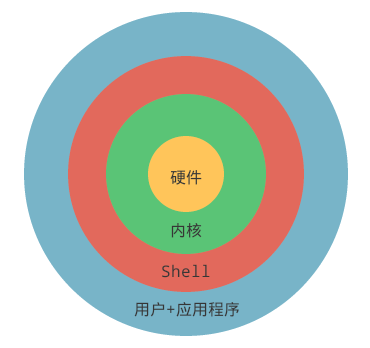

### 引言
现在我们使用的操作系统（Windows、Mac OS、Android、iOS 等）都是带图形界面的,然而在计算机的早期并没有图形界面，我们只能通过一个一个地命令来控制计算机。对于图形界面，用户点击某个图标就能启动某个程序；对于命令行，用户输入某个程序的名字（可以看做一个命令）就能启动某个程序。这两者的基本过程都是类似的，都需要查找程序在硬盘上的安装位置，然后将它们加载到内存运行。  
换句话说，图形界面和命令行要达到的目的是一样的，都是让用户控制计算机。然而，真正能够控制计算机硬件（CPU、内存、显示器等）的只有操作系统内核（Kernel），图形界面和命令行只是架设在用户和内核之间的一座桥梁。由于安全、复杂、繁琐等原因，用户不能直接接触内核（也没有必要），需要另外再开发一个程序，让用户直接使用这个程序；该程序的作用就是接收用户的操作（点击图标、输入命令），并进行简单的处理，然后再传递给内核。如此一来，用户和内核之间就多了一层“代理”，这层“代理”既简化了用户的操作，也保护了内核，见图1。  
  
用户界面和命令行就是这个另外开发的程序，就是这层“代理”。在Linux下，这个命令行程序叫做 Shell。
### 一.Shell是什么
Shell俗称壳（用来区别于核），是指“为使用者提供操作界面”的软件（命令解析器）。它类似于DOS下的command.com和后来的cmd.exe。它接收用户命令，然后调用相应的应用程序。作为命令语言，它交互式解释和执行用户输入的命令或者自动地解释和执行预先设定好的一连串的命令；作为程序设计语言，它定义了各种变量和参数，并提供了许多在高级语言中才具有的控制结构，包括循环和分支。
### 二.Shell的功能
Shell 除了能解释用户输入的命令，将它传递给内核，还可以：  
1. 调用其他程序，给其他程序传递数据或参数，并获取程序的处理结果；  
2. 在多个程序之间传递数据，把一个程序的输出作为另一个程序的输入；  
3. Shell 本身也可以被其他程序调用。  
Shell 本身支持的命令并不多，但是它可以调用其他的程序，每个程序就是一个命令，这使得 Shell 命令的数量可以无限扩展，其结果就是 Shell 的功能非常强大，完全能够胜任 Linux 的日常管理工作，如文本或字符串检索、文件的查找或创建、大规模软件的自动部署、更改系统设置、监控服务器性能、发送报警邮件、抓取网页内容、压缩文件等。
### 三.Shell的分类
#### shell基本上分两大类：  
一：图形界面shell（Graphical User Interface shell 即 GUI shell）  
例如：应用最为广泛的 Windows Explorer （微软的windows系列操作系统），还有也包括广为人知的 Linux shell，其中linux shell 包括 X window manager (BlackBox和FluxBox），以及功能更强大的CDE、GNOME、KDE、 XFCE。  
二：命令行式shell（Command Line Interface shell ，即CLI shell）  
例如：  
bash / sh / ksh / csh（Unix/linux 系统）  
（MS-DOS系统）  
cmd.exe/ 命令提示字符（Windows NT 系统）  
Windows PowerShell（支持 .NET Framework 技术的 Windows NT 系统）  
传统意义上的shell指的是命令行式的shell，以后如果不特别注明，shell是指命令行式的shell,如Linux系统的shell（见图2），进入方式有：通过Teminal终端图标进入或者通过快捷键“Ctrl+Alt+T”进入。  
  
#### bash和sh的区别
以Linux系统为例，其中bash shell是Linux的默认shell。在现代的Linux上，sh已经被bash代替，/bin/sh往往是指向/bin/bash的符号链接。bash兼容sh意味着，针对sh编写的 Shell代码可以不加修改地在bash中运行。  
尽管如此，bash 和 sh 还是有一些不同之处：  
●一方面，bash 扩展了一些命令和参数；  
●另一方面，bash 并不完全和 sh 兼容，它们有些行为并不一致，但在大多数企业运维的情况下区别不大，特殊场景可以使用 bash 代替 sh。  
另外，可通过命令查看Linux系统可用的shell（见图3）和Linux系统默认的shell（见图4）  
  
  
### 四.Shell提示符
提示符是通往 Shell 的大门，是输入 Shell 命令的地方。  
对于普通用户，Base shell 默认的提示符是美元符号$；对于超级用户（root 用户），Bash Shell 默认的提示符是井号#。该符号表示 Shell 等待输入命令。  
不同的 Linux 发行版使用的提示符格式不同。例如在 CentOS 中，默认的提示符格式为：[mozhiyan@localhost ~]$  
Shell 通过PS1和PS2两个环境变量来控制提示符格式：  
● PS1 控制最外层命令行的提示符格式。  
● PS2 控制第二层命令行的提示符格式。  
在 Shell 中初次输入命令，使用的是 PS1 指定的提示符格式；如果输入一个命令后还需要输入附加信息，Shell 就使用 PS2 指定的提示符格式。  
### 五.运行Shell脚本的两种方式
#### 1.作为可执行程序  
Shell 脚本也是一种解释执行的程序，可以在终端直接调用（需要使用 chmod 命令给 Shell 脚本加上执行权限），如图5所示：
  
第2行中，chmod +x表示给 test.sh 增加执行权限；  
第3行中，"./"表示当前目录，整条命令的意思是执行当前目录下的 test.sh 脚本。如果不写"./"，Linux 会到系统路径（由 PATH 环境变量指定）下查找 test.sh，而系统路径下显然不存在这个脚本，所以会执行失败。  
通过这种方式运行脚本，第一行一定要写对，好让系统查找到正确的解释器。  
举例如下，首先在文本编辑器中新建一个名为test.sh（扩展名sh代表shell）的文件，内容如图6左侧所示；然后按图5命令执行，结果如图6右侧。  
  
##### 在这里，提一下source 命令:
source FileName： 在当前bash环境下读取并执行FileName中的命令； 该命令通常用命令“.”来替代。  
这两个命令都以一个脚本为参数，该脚本将作为当前shell的环境执行，即不会启动一个新的子进程。所有在脚本中设置的变量将成为当前Shell的一部分。  
source filename 与 sh filename 及./filename执行脚本的区别:  
●当shell脚本具有可执行权限时，用sh filename与./filename执行脚本是没有区别的。./filename是因为当前目录没有在PATH中，所有”.”是用来表示当前目录的。  
●sh filename 重新建立一个子shell，在子shell中执行脚本里面的语句，该子shell继承父shell的环境变量，但子shell新建的、改变的变量不会被带回父shell。  
●source filename：这个命令其实只是简单地读取脚本里面的语句依次在当前shell里面执行，没有建立新的子shell。那么脚本里面所有新建、改变变量的语句都会保存在当前shell里面。  
#### 2.作为解释器参数  
这种运行方式是，直接运行解释器，其参数就是shell脚本的文件名，见图7：  
  
### 六.Shell常用命令
#### 1.Shell echo命令
Shell的echo命令与PHP的echo命令类似，都是用于字符串的输出。命令格式如下:  
echo string  
你可以使用echo实现更为复杂的输出格式控制。  
##### (1)显示普通字符串
echo "It is a test",这里的双引号完全可以省略。  
##### (2)显示转义字符
echo "\"It is a test"\"，结果是"It is a test"  
##### (3)显示变量
将以下代码保存在t.sh中：  
#！/bin/bash  
read name  
echo "$name It is a test"  
按照执行程序的方式执行该文件，其结果是：  
  
##### (4)显示换行
  
##### (5)显示不换行
  
##### (6)显示结果至定向文件
  
##### (7)原样输出字符，不进行转义或取变量(用单引号)
  
##### (8)显示命令执行结果
  
#### 2.Shell printf命令
printf 命令模仿 C 程序库（library）里的 printf() 程序。  
printf 由 POSIX 标准所定义，因此使用 printf 的脚本比使用 echo 移植性好。  
printf 使用引用文本或空格分隔的参数，外面可以在 printf 中使用格式化字符串，还可以制定字符串的宽度、左右对齐方式等。默认 printf 不会像 echo 自动添加换行符，我们可以手动添加 \n。  
printf 命令的语法：  
printf  format-string  [arguments...]  
参数说明：  
format-string: 为格式控制字符串  
arguments: 为参数列表。  
#### 3.Shell test命令
Shell中的 test 命令用于检查某个条件是否成立，它可以进行数值、字符和文件三个方面的测试。（具体见官网）  
#### 4.Shell函数
linux shell 可以用户定义函数，然后在shell脚本中可以随便调用。  
shell中函数的定义格式如下：  
[ function ] funname [()]  

{  

    action;  

    [return int;]  

}  
说明：  
1、可以带function fun() 定义，也可以直接fun() 定义,不带任何参数。  
2、参数返回，可以显示加：return 返回，如果不加，将以最后一条命令运行结果，作为返回值。 return后跟数值n(0-255)  

### Shell的其它用法和相关命令详情见网站http://c.biancheng.net/shell/和http://www.runoob.com/linux/linux-shell.html
